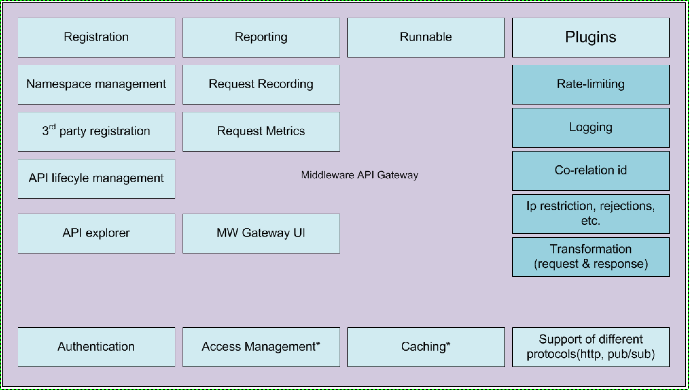

|  | All curated documentation has moved to the connections github pages wiki |
|------|-----------|
|**Source** | https://github.ibm.com/connections/connections-wiki/ |
|**Wiki view** |https://pages.github.ibm.com/connections/connections-wiki/wiki |

|            |                     |                        |                   |
|------------|---------------------|------------------------|-------------------|
| **Title**  | *API Gateway Conent*             | **Status**             | *InProgress*      |
| **Owner**  | *J. Lu*             | **Additional Editors** | *Maureen*,*Andre* |
| **Due**    | *June 26, 2017*              | **Customer review ?**  | *no*        |

### Summary
API Gateway serves as the only micro-service that exposes public APIs. Full description of the API Gateway functions is [API Structure Position Paper](
https://github.ibm.com/connections/connections-planning/blob/master/docs/positionpapers/api/appdev.md)

### Scope
This document describes the highlights of the API Gateway design. Details are available in this [API Management and Gateway Overview](https://apps.na.collabserv.com/wikis/home?lang=en-us#!/wiki/W28b8df99093e_468e_880f_000d19d33b5c/page/API%20Management%20and%20Gateway%20Overview)

### Actions from this paper
Validate the design with other teams.

### Timeline for these actions
Now, or ASAP

### What teams need to do
Work with the API Gateway team to define their APIs

### Customer Review

Yes, we like to validate our designs

### Content

API Gateway Highlights

- Modernization
  -- All JSON based
  -- Use standards, Swagger 2.0 Spec (http://swagger.io/specification)
- Compatibility
  - Forward: old clients working with new Pink apps
  - Backward: new clients working with legacy Connections deployments
- Performance, Scalability and Charging
  -- Via caching and throttling
- Upgrade/deployment
  - Continuous delivery
  - Co-exist with older versions via version management
- Consumability
  - StrongLoop/API Connect API Explorer
  - Utilize common logging and monitoring micro-services
  - Simplify existing APIs, like adding tags, edit profile extension fields, etc.
- Customization
  - Customers can provide their own templates to extend/modify API payloads
  - Customization can be made per org and per app basis
- New Capabilities
  - Common APIs: tagging, commenting/remarking, following, sharing contents(?)
  - GraphQL support - Support scope TBD
- Consistency (See API common rules and best practice slides later)
  - Versioning
  - API endpoints
  - Request parameters
    - ID, ps, page, etc.
  - Common header specification
    - Caching, auth, etc.
- Extensibility
  - Provide plug-able modules so that the API interface can work with different back-end apps
  - Legacy Connections Apps ( supported out-of-box)
  - Pink apps: People service and Content service supported out-of-box
  - Other 3rd party apps
    - Files: Box to replace Connections Files (support TBD)
    - Wikis: Confluence, Socialtext, Jive and TeamPage (support TBD)
    - Blogs: WordPress, Tumblr (support TBD)
- API Gateway Features and Functions
  - Provide direct proxying and securing backend services
  - Implement and finalize API registration and life cycle
  - Framework ownership for old-meets-new
  - MW API GW deployment stack (nginx front/rp caching proxy front ahead of apigw)
  - Manage life-cycle of registered APIs
  - Provide template of API registration for services like LiveGrid & Content
  - MW api explorer - UI to document APIs (this can be provided in Pink via another way, however discovery of the APIs themselves will leverage this middleware layer)
  - Design how request flows through API GW (going thru recording, pre and post extensions etc.)
  - Incorporate design process flow into API GW processing (extend direct proxy)
  - API Analytics (including coverage)
  - Rate limiting/throttling of API calls
  - Ability to do simple transformations
  - Handle pre/post extensions, custom additions, runnables
  - Extendable by BPs and customers (with multi-tenancy attributes)
  - Ability to 'stitch' responses from a 'simple' set of microservices that make up a service
  - Consumer identification
  - Caching

The full API Gateway design is available in the API Gateway section in this [Middleware Design Doc.](https://apps.na.collabserv.com/communities/service/html/communityview?communityUuid=71676fab-07a6-420a-97c5-600359a8b773#fullpageWidgetId=W25b2035e7d79_4557_ae9e_e48296475d91&file=c77b25ed-ad4e-4487-8068-65d45bff64e0) and the [API Management and Gateway Overview](https://apps.na.collabserv.com/wikis/home?lang=en-us#!/wiki/W28b8df99093e_468e_880f_000d19d33b5c/page/API%20Management%20and%20Gateway%20Overview)
